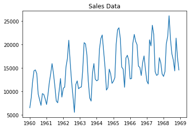
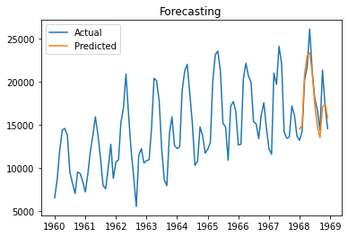
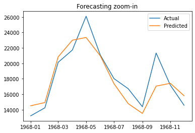

# Facebook Prophet (Car Sales Forecasting)


```python
import pandas as pd
from sklearn.metrics import mean_absolute_error
import matplotlib.pyplot as plt
from prophet import Prophet
```

## 1. Data


```python
df = pd.read_csv('monthly-car-sales.csv')
```


```python
df.head()
```


<div>
<style scoped>
    .dataframe tbody tr th:only-of-type {
        vertical-align: middle;
    }

    .dataframe tbody tr th {
        vertical-align: top;
    }

    .dataframe thead th {
        text-align: right;
    }
</style>
<table border="1" class="dataframe">
  <thead>
    <tr style="text-align: right;">
      <th></th>
      <th>Month</th>
      <th>Sales</th>
    </tr>
  </thead>
  <tbody>
    <tr>
      <th>0</th>
      <td>1960-01</td>
      <td>6550</td>
    </tr>
    <tr>
      <th>1</th>
      <td>1960-02</td>
      <td>8728</td>
    </tr>
    <tr>
      <th>2</th>
      <td>1960-03</td>
      <td>12026</td>
    </tr>
    <tr>
      <th>3</th>
      <td>1960-04</td>
      <td>14395</td>
    </tr>
    <tr>
      <th>4</th>
      <td>1960-05</td>
      <td>14587</td>
    </tr>
  </tbody>
</table>
</div>


```python
df.columns = ['ds','y']
df['ds'] = pd.to_datetime(df['ds'])
```


```python
plt.plot(df.ds, df.y)
plt.title('Sales Data')
plt.show()
```


    

    


## 2. Model


```python
train = df.drop(df.index[-12:])

model = Prophet()
model.fit(train)

future = pd.DataFrame([f"1968-{i:02d}" for i in range(1, 13)], columns=['ds'])
future['ds'] = pd.to_datetime(future['ds'])

# use the model to make a forecast
forecast = model.predict(future)

# calculate MAE between expected and predicted values for december
y_true = df['y'][-12:].values
y_pred = forecast['yhat'].values
mae = mean_absolute_error(y_true, y_pred)
print('MAE: %.3f' % mae)
```

    INFO:prophet:Disabling weekly seasonality. Run prophet with weekly_seasonality=True to override this.
    INFO:prophet:Disabling daily seasonality. Run prophet with daily_seasonality=True to override this.


    
    Initial log joint probability = -104.85
    Iteration  1. Log joint probability =    72.7915. Improved by 177.641.
    Iteration  2. Log joint probability =     141.49. Improved by 68.6982.
    Iteration  3. Log joint probability =    148.523. Improved by 7.03351.
    Iteration  4. Log joint probability =    148.546. Improved by 0.0223531.
    Iteration  5. Log joint probability =    148.554. Improved by 0.00880483.
    Iteration  6. Log joint probability =    148.576. Improved by 0.0214036.
    Iteration  7. Log joint probability =    148.585. Improved by 0.00973269.
    Iteration  8. Log joint probability =    148.606. Improved by 0.0204538.
    Iteration  9. Log joint probability =    148.617. Improved by 0.0106609.
    Iteration 10. Log joint probability =    148.636. Improved by 0.0195037.
    Iteration 11. Log joint probability =    148.648. Improved by 0.0115894.
    Iteration 12. Log joint probability =    148.666. Improved by 0.0185532.
    Iteration 13. Log joint probability =    148.679. Improved by 0.0125183.
    Iteration 14. Log joint probability =    148.696. Improved by 0.0176024.
    Iteration 15. Log joint probability =     148.71. Improved by 0.0134475.
    Iteration 16. Log joint probability =    148.726. Improved by 0.0166513.
    Iteration 17. Log joint probability =    148.741. Improved by 0.0143771.
    Iteration 18. Log joint probability =    148.757. Improved by 0.0156999.
    Iteration 19. Log joint probability =    148.772. Improved by 0.015307.
    Iteration 20. Log joint probability =    148.787. Improved by 0.0147481.
    Iteration 21. Log joint probability =    148.803. Improved by 0.0162373.
    Iteration 22. Log joint probability =    148.817. Improved by 0.0137961.
    Iteration 23. Log joint probability =    148.834. Improved by 0.0171679.
    Iteration 24. Log joint probability =    148.847. Improved by 0.0128437.
    Iteration 25. Log joint probability =    148.865. Improved by 0.0180988.
    Iteration 26. Log joint probability =    148.877. Improved by 0.0118909.
    Iteration 27. Log joint probability =    148.896. Improved by 0.0190301.
    Iteration 28. Log joint probability =    148.907. Improved by 0.0109379.
    Iteration 29. Log joint probability =    148.927. Improved by 0.0199618.
    Iteration 30. Log joint probability =    148.937. Improved by 0.00998453.
    Iteration 31. Log joint probability =    148.957. Improved by 0.0208938.
    Iteration 32. Log joint probability =    148.966. Improved by 0.00903083.
    Iteration 33. Log joint probability =    148.988. Improved by 0.0218261.
    Iteration 34. Log joint probability =    148.996. Improved by 0.00807681.
    Iteration 35. Log joint probability =    149.019. Improved by 0.0227589.
    Iteration 36. Log joint probability =    149.026. Improved by 0.00712245.
    Iteration 37. Log joint probability =     149.05. Improved by 0.0236919.
    Iteration 38. Log joint probability =    149.056. Improved by 0.00616777.
    Iteration 39. Log joint probability =    149.081. Improved by 0.0246253.
    Iteration 40. Log joint probability =    149.086. Improved by 0.00521276.
    Iteration 41. Log joint probability =    149.112. Improved by 0.0255591.
    Iteration 42. Log joint probability =    149.116. Improved by 0.00425742.
    Iteration 43. Log joint probability =    149.142. Improved by 0.0264932.
    Iteration 44. Log joint probability =    149.146. Improved by 0.00330174.
    Iteration 45. Log joint probability =    149.173. Improved by 0.0274277.
    Iteration 46. Log joint probability =    149.175. Improved by 0.00234573.
    Iteration 47. Log joint probability =    149.204. Improved by 0.0283625.
    Iteration 48. Log joint probability =    149.205. Improved by 0.00138939.
    Iteration 49. Log joint probability =    149.234. Improved by 0.0292977.
    Iteration 50. Log joint probability =    149.235. Improved by 0.000432716.
    Iteration 51. Log joint probability =    149.265. Improved by 0.0302333.
    Iteration 52. Log joint probability =    149.314. Improved by 0.0491703.
    Iteration 53. Log joint probability =    182.761. Improved by 33.4463.
    Iteration 54. Log joint probability =     189.18. Improved by 6.41958.
    Iteration 55. Log joint probability =    189.265. Improved by 0.0845877.
    Iteration 56. Log joint probability =     189.29. Improved by 0.0254509.
    Iteration 57. Log joint probability =    189.383. Improved by 0.0928119.
    Iteration 58. Log joint probability =    189.407. Improved by 0.0237773.
    Iteration 59. Log joint probability =     189.48. Improved by 0.0737264.
    Iteration 60. Log joint probability =    189.609. Improved by 0.128704.
    Iteration 61. Log joint probability =    189.658. Improved by 0.0487217.
    Iteration 62. Log joint probability =    189.845. Improved by 0.187362.
    Iteration 63. Log joint probability =    190.346. Improved by 0.501064.
    Iteration 64. Log joint probability =    199.123. Improved by 8.77684.
    Iteration 65. Log joint probability =    199.352. Improved by 0.229142.
    Iteration 66. Log joint probability =     202.52. Improved by 3.16772.
    Iteration 67. Log joint probability =    204.436. Improved by 1.91611.
    Iteration 68. Log joint probability =    207.108. Improved by 2.67166.
    Iteration 69. Log joint probability =    207.484. Improved by 0.376049.
    Iteration 70. Log joint probability =     212.51. Improved by 5.02648.
    Iteration 71. Log joint probability =     216.04. Improved by 3.52948.
    Iteration 72. Log joint probability =    216.893. Improved by 0.853308.
    Iteration 73. Log joint probability =    219.055. Improved by 2.16158.
    Iteration 74. Log joint probability =    219.719. Improved by 0.664594.
    Iteration 75. Log joint probability =     220.82. Improved by 1.10064.
    Iteration 76. Log joint probability =    221.052. Improved by 0.231763.
    Iteration 77. Log joint probability =    222.067. Improved by 1.01557.
    Iteration 78. Log joint probability =    222.516. Improved by 0.449119.
    Iteration 79. Log joint probability =    223.531. Improved by 1.01494.
    Iteration 80. Log joint probability =     223.57. Improved by 0.0390872.
    Iteration 81. Log joint probability =    223.716. Improved by 0.145833.
    Iteration 82. Log joint probability =    223.735. Improved by 0.0188064.
    Iteration 83. Log joint probability =    225.547. Improved by 1.81196.
    Iteration 84. Log joint probability =    225.818. Improved by 0.271325.
    Iteration 85. Log joint probability =    226.111. Improved by 0.292685.
    Iteration 86. Log joint probability =    226.373. Improved by 0.262285.
    Iteration 87. Log joint probability =    227.129. Improved by 0.755468.
    Iteration 88. Log joint probability =    227.969. Improved by 0.840713.
    Iteration 89. Log joint probability =     228.15. Improved by 0.180627.
    Iteration 90. Log joint probability =    228.152. Improved by 0.00197275.
    Iteration 91. Log joint probability =    228.928. Improved by 0.775614.
    Iteration 92. Log joint probability =    229.045. Improved by 0.117062.
    Iteration 93. Log joint probability =    230.208. Improved by 1.16325.
    Iteration 94. Log joint probability =     230.25. Improved by 0.0424113.
    Iteration 95. Log joint probability =     232.93. Improved by 2.67962.
    Iteration 96. Log joint probability =    233.449. Improved by 0.518669.
    Iteration 97. Log joint probability =    234.032. Improved by 0.582873.
    Iteration 98. Log joint probability =    234.089. Improved by 0.0577372.
    Iteration 99. Log joint probability =    234.117. Improved by 0.0274991.
    Iteration 100. Log joint probability =    234.625. Improved by 0.507974.
    Iteration 101. Log joint probability =    234.818. Improved by 0.193493.
    Iteration 102. Log joint probability =     234.86. Improved by 0.0414048.
    Iteration 103. Log joint probability =    234.874. Improved by 0.0147599.
    Iteration 104. Log joint probability =    234.891. Improved by 0.0163406.
    Iteration 105. Log joint probability =    234.962. Improved by 0.0714811.
    Iteration 106. Log joint probability =    234.967. Improved by 0.00502642.
    Iteration 107. Log joint probability =    234.981. Improved by 0.0136709.
    Iteration 108. Log joint probability =     234.99. Improved by 0.00891701.
    Iteration 109. Log joint probability =    234.993. Improved by 0.00302646.
    Iteration 110. Log joint probability =    234.999. Improved by 0.00594333.
    Iteration 111. Log joint probability =    235.002. Improved by 0.00281259.
    Iteration 112. Log joint probability =    235.003. Improved by 0.00117052.
    Iteration 113. Log joint probability =    235.003. Improved by 0.000413677.
    Iteration 114. Log joint probability =    235.004. Improved by 0.000287033.
    Iteration 115. Log joint probability =    235.004. Improved by 0.000618184.
    Iteration 116. Log joint probability =    235.004. Improved by 0.000135189.
    Iteration 117. Log joint probability =    235.004. Improved by 0.000144716.
    Iteration 118. Log joint probability =    235.005. Improved by 0.000400957.
    Iteration 119. Log joint probability =    235.005. Improved by 0.000384067.
    Iteration 120. Log joint probability =    235.006. Improved by 0.00056182.
    Iteration 121. Log joint probability =    235.006. Improved by 0.000256115.
    Iteration 122. Log joint probability =    235.006. Improved by 6.65829e-05.
    Iteration 123. Log joint probability =    235.006. Improved by 0.00021742.
    Iteration 124. Log joint probability =    235.006. Improved by 6.68548e-05.
    Iteration 125. Log joint probability =    235.006. Improved by 2.75456e-05.
    Iteration 126. Log joint probability =    235.006. Improved by 6.17351e-06.
    Iteration 127. Log joint probability =    235.006. Improved by 1.91284e-05.
    Iteration 128. Log joint probability =    235.006. Improved by 7.10855e-06.
    Iteration 129. Log joint probability =    235.006. Improved by 1.1545e-05.
    Iteration 130. Log joint probability =    235.006. Improved by 2.58638e-06.
    Iteration 131. Log joint probability =    235.006. Improved by 1.62733e-05.
    Iteration 132. Log joint probability =    235.006. Improved by 9.03168e-06.
    Iteration 133. Log joint probability =    235.007. Improved by 2.15254e-05.
    Iteration 134. Log joint probability =    235.007. Improved by 2.9475e-05.
    Iteration 135. Log joint probability =    235.007. Improved by 2.75359e-05.
    Iteration 136. Log joint probability =    235.007. Improved by 2.04024e-05.
    Iteration 137. Log joint probability =    235.007. Improved by 6.4026e-06.
    Iteration 138. Log joint probability =    235.007. Improved by 4.12343e-06.
    Iteration 139. Log joint probability =    235.007. Improved by 1.91538e-06.
    Iteration 140. Log joint probability =    235.007. Improved by 9.89822e-07.
    Iteration 141. Log joint probability =    235.007. Improved by 3.15813e-06.
    Iteration 142. Log joint probability =    235.007. Improved by 5.72598e-06.
    Iteration 143. Log joint probability =    235.007. Improved by 4.58836e-07.
    Iteration 144. Log joint probability =    235.007. Improved by 8.05823e-07.
    Iteration 145. Log joint probability =    235.007. Improved by 2.68685e-06.
    Iteration 146. Log joint probability =    235.007. Improved by 3.28763e-07.
    Iteration 147. Log joint probability =    235.007. Improved by 4.72154e-07.
    Iteration 148. Log joint probability =    235.007. Improved by 7.37091e-07.
    Iteration 149. Log joint probability =    235.007. Improved by 1.24637e-06.
    Iteration 150. Log joint probability =    235.007. Improved by 3.09089e-07.
    Iteration 151. Log joint probability =    235.007. Improved by 6.85304e-07.
    Iteration 152. Log joint probability =    235.007. Improved by 1.61311e-07.
    Iteration 153. Log joint probability =    235.007. Improved by 1.31026e-07.
    Iteration 154. Log joint probability =    235.007. Improved by 2.70308e-07.
    Iteration 155. Log joint probability =    235.007. Improved by 9.66573e-08.
    Iteration 156. Log joint probability =    235.007. Improved by 7.69223e-08.
    Iteration 157. Log joint probability =    235.007. Improved by 1.98706e-07.
    Iteration 158. Log joint probability =    235.007. Improved by 9.77984e-08.
    Iteration 159. Log joint probability =    235.007. Improved by 2.43384e-08.
    Iteration 160. Log joint probability =    235.007. Improved by 2.37249e-08.
    Iteration 161. Log joint probability =    235.007. Improved by 1.66566e-08.
    Iteration 162. Log joint probability =    235.007. Improved by 4.98366e-09.
    MAE: 1336.814


## 3. Evaluation


```python
plt.title('Forecasting')
plt.plot(df['ds'], df['y'], label='Actual')
plt.plot(future, y_pred, label='Predicted')
plt.legend()
plt.show()

plt.title('Forecasting zoom-in')
plt.plot(df.iloc[-12:]['ds'], df.iloc[-12:]['y'].values, label='Actual')
plt.plot(df.iloc[-12:]['ds'], y_pred, label='Predicted')
plt.legend()
plt.show()
```


    

    


    

    

